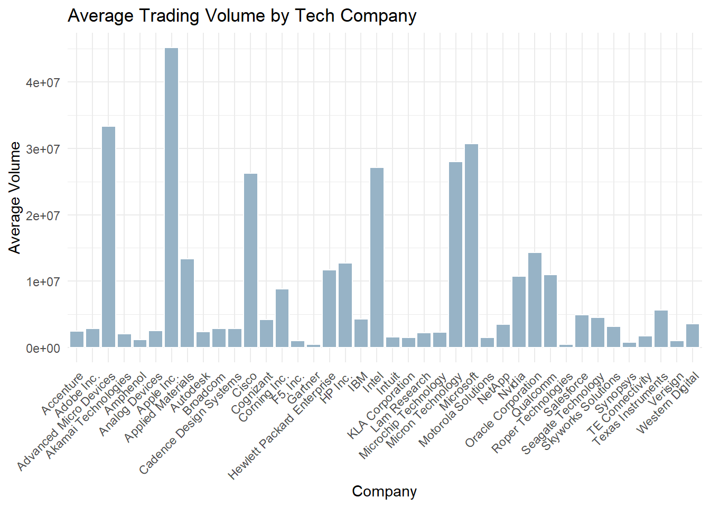
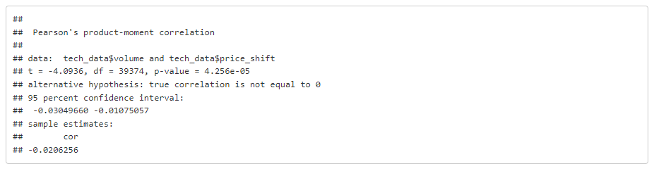
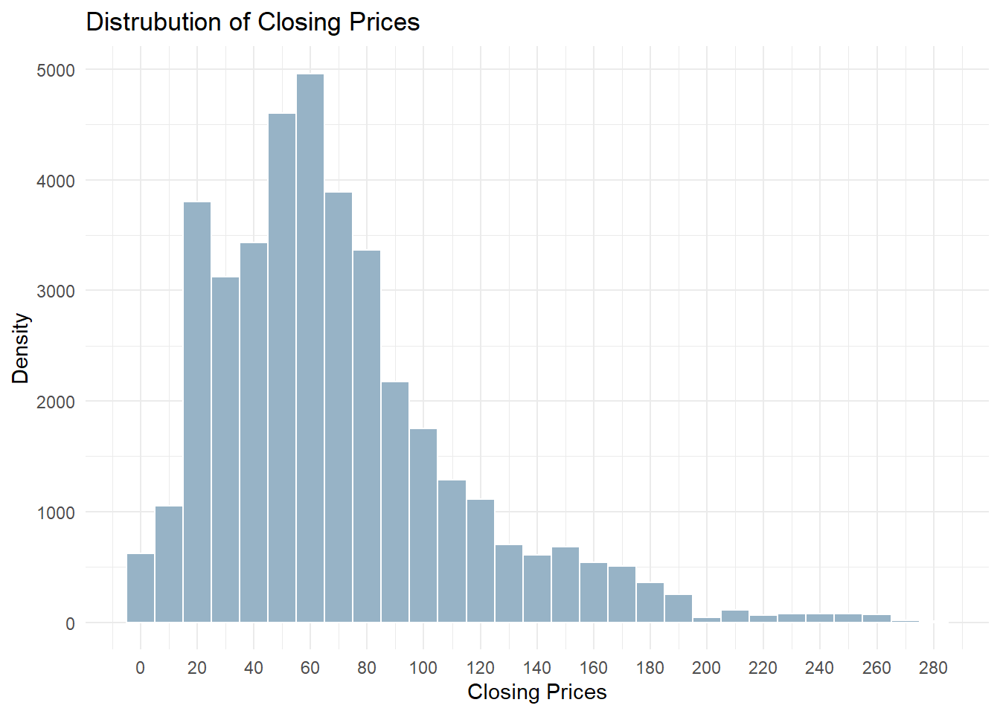
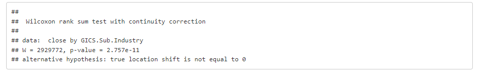

# S&P500_Technology_Stocks_Analysis

## Introduction
In this analysis I will be taking a look at ticker data from stocks in the Information Technology sector of the S&P 500 collected from the start of 2014 to the end of 2017, and all price values in the data set are in USD.

### Columns in Tech_data.csv
1. symbol: This is the ticker symbol for the stock. Ex: AAPL
2. date: The date of the stock's entry.
3. open: The price that the stock opened the day at.
4. high: The highest price the stock recorded for the day.
5. low: The lowest price that stock recorded for the day.
6. close: The price the stock held at the end of the day.
7. volume: The day's trading volume for the stock.
8. Security: The public name of the company that holds the stock. Ex: Apple Inc.
9. GICS.Sector: The wider sector the stock is part of.
10. GICS.Sub.Industry: The sub sector of the sector the stock occupies. Ex: IT Consulting & Other Services

## Data Set Construction
Tech_data.csv is was constructed by combining two seperate data sets and then selecting out a subset of the larger data set that comprised just GICS.Sector data from the Information Technoloy sector. 

**Original Data Set** ([link](https://www.kaggle.com/datasets/mysarahmadbhat/stock-prices)): Contains stock time series information. The columns it contains include the stock's symbol, date, open, high, low, and close. 

**Added Data Set** ([link](https://en.wikipedia.org/wiki/List_of_S%26P_500_companies?utm_source=chatgpt.com)): This data set contains master data on individual stocks. The data that it provides is the stock's symbol, its security, GICS Sector, and GICS Sub-Industry. 

The two data sets were linked together using the stock symbols as a common field, and then cleaned by having any records with missing data removed.

## Setting the root data set:

```r
tech_data<-read.csv('tech_data.csv')
```

**Add Libraries

```r
library(tidyr)
library(dplyr)
library(ggplot2)
```

## My Overall Question
Going into this analysis, the question I want to research is whether there are any variables present in the data set that could be used to predict the future directional change of a stock’s value. This question will be refined and adjusted as I explore the dataset.

## First Look
To start off I will first take a look at the top 5 Information Technology companies to get a visual comparison of how their closing prices compare over time. To do this I will first need to figure out what the top five companies are and create a small dataframe that contains just their information. I will be using a company's average daily trading volumn as the metric for comparing the companies against each other when determine the top five companies. Finally I will use ggplot to generate a line graph so we can visualy the closing prices for the stocks over the span of the data set. 

1. Select the top 5 Technology Stocks by average volume to create a sub data set.

```r
# Obtain a list of the symbols for the top 5 information technology stocks
top_symbols <- tech_data %>%
  group_by(symbol) %>%
  summarise(avg_volume = mean(volume, na.rm = TRUE)) %>%
  arrange(desc(avg_volume)) %>%
  slice(1:5) %>%
  pull(symbol)

# Create smaller data set by filtering larger data set by the created list of top 5 information technology stock symbols
tech_top <- tech_data %>%
  filter(symbol %in% top_symbols)
```

2. Create a multi-line graph to display the closing values of the top 5 tech stocks over the span of the data set.

```r
ggplot(tech_top, aes(x = date, y = close, color = Security)) +
     geom_line() +
     theme_minimal()+
     labs(title = "Top 5 Tech Stocks by Avg Volume",
          x = "Date", y = "Closing Price")
```


This graph shows the time series data for the daily closing prices of the top five performing stocks in the Information Technology sector. The results were limited to the top 5 stocks in this sector due to the Information Technology sector comprising 40 different stocks, which was done for readability purposes. The top technology stocks were determined by comparing their average daily trading volume with that of the stocks in the sector. According to the graph, Apple Inc. was the best-performing stock, with an overall upward trend that significantly outperformed the other four top stocks. Microsoft is next in line.

## Average Daily Trading Volume for All Information Technoloy Stocks

Previously, we extracted the top 5 Information Technology stocks to compare against each other. This time, we will use a bar chart to plot the values of every stock in the Information Technology sector to see if any information can be derived. To do this I will be finding the mean of the daily trading volumes for each stock.

1. Calculate the average volume of the technology stocks.

```r
avg_volume_data <- tech_data %>%
  group_by(symbol, Security) %>%
  summarise(avg_volume = mean(volume, na.rm = TRUE), .groups = "drop")
```

2. Create a bar chart that shows the average trading volume of each company in the Information Technology sector.

```r
ggplot(avg_volume_data, aes(x = Security, y = avg_volume)) +
  geom_bar(stat = "identity", fill = "#97B3C6", color="white") +
  theme_minimal()+
  labs(title = "Average Trading Volume by Tech Company",
       x = "Company",
       y = "Average Volume") +
  theme(axis.text.x = element_text(angle = 45, hjust = 1))
```



The graph displays the names of companies in the Information Technology sector along the X-axis and their average trading volume on the Y-axis. Examining this graph alongside our first graph, we can see similarities between the top 5 performing Information Technology stocks. The top 5 performing Information Technology stocks are the same stocks shown on this graph, which have the top 5 average daily trading volumes; however, their ranking order is slightly different. Returning to my original question, these first two graphs lead me to wonder if daily trading volume has a significant impact on a stock’s performance.


## Testing to See if a Corrolation Exists Between the Opening and Closing of Information Technology Stocks

We will test to see if there is a correlation between the daily number of trades and the daily price shift of a stock in the Information Technology sector.

1. Add a column to our data set for daily price shifts.

```r
tech_data <- tech_data %>%
  mutate(price_shift = close - open)
```

2. Do a correlation test testing volume and price_shift against each other.

```r
cor_test <- cor.test(tech_data$volume, tech_data$price_shift)
cor_test
```



The goal was to check if there was a correlation between daily trading volume and daily changes in stock prices. The number of observations in the data set was checked because a small correlation could have a larger impact when the data set is larger. Here is what we learned from the results:

1. Our confidence interval of 95% would give us an alpha of 0.05, and since our resulting p-value of 4.256e-05 is smaller than 0.05, we will reject the null hypothesis that there is no correlation between the daily trading volumes and daily stock price changes.

2. Even though a correlation exists, our corr value of -0.0206256 tells us that it’s basically an insignificant correlation that, if it were ever to show up, would manifest as increased trading volume resulting in slight downward daily stock price shifts and vice versa.


## Distrubution of Daily Closing Prices

Now we will take a look at the individual closing prices of all Information Technology stocks to see if they form a recognisable distrubution. To do this I will use a histogram where the X-axis contains bins for different closing values. 

```r
ggplot(data = tech_data, aes(close))+
  geom_histogram(binwidth = 10, fill="#97B3C6", color="white")+
  theme_minimal()+
  scale_x_continuous(breaks = seq(0,max(tech_data$close, na.rm=TRUE), by=20))+
  labs(x = "Closing Prices",
    y = "Density",
    title = "Distrubution of Closing Prices"
  )
```



The resulting distribution of closing prices forms a left-skewed curve. Across the 40 stocks in the Information Technology sector, the majority of the 39,379 observed closing prices fall between $20 and $100, with decreasing frequency extending out to around $260.

Several factors could explain this distribution. Lower closing prices may reflect subpar stock performance at the time of observation, or they could result from stock splits intended to maintain accessible prices. An interesting follow-up question is whether the higher-priced observations represent a consistent group of stocks or if occasional outliers drive them. If the higher-priced stocks are consistent, comparing them with the top five stocks by trading volume identified in Question 1 could provide additional insight into sector dynamics.

## Checking to See if a Relationship Exists Between the Top Sub Industries 

1. First we will check to see how many Sub Industries exist in the Information Technology sector to see if its a viable point to sub divide the data.

```r
 num_unique <- length(unique(tech_data$GICS.Sub.Industry))
num_unique
```


We have 11 Information Technology Sub-Sectors to work with, so we will perform our analysis on the top 2 Sub-Sectors using the same ranking metric of daily trading volume and a comparative metric of closing price.

2. Following the same methodology as the first section, we will figure out what the top 2 performing Sub Industries in the Information Technology sector are by average trading volume.

```r
top_two_groups <- tech_data %>%
  group_by(GICS.Sub.Industry) %>%
  summarise(avg_volume = mean(volume, na.rm = TRUE)) %>%
  arrange(desc(avg_volume)) %>%
  slice(1:2) %>%
  pull(GICS.Sub.Industry)
```

3. Create a smaller data set containing just the information on the top 2 performing Information Technology Sub Industries by filtering the larger Information Technology data set.

```r
two_groups_data <- tech_data %>%
  filter(GICS.Sub.Industry %in% top_two_groups)
```

4. Since the data was found to be left-skewed when plotting the histogram section 4, I cannot use any statistical tests that assume a normal distribution of data. Therefore, I will use a Mann-Whitney U test and stick with closing prices as our metric.

```r
wilcox.test(close~GICS.Sub.Industry, data=two_groups_data)
```



The resulting p-value is really small, much smaller than the default 95% confidence coefficient (alpha: 0.05) allows. Since the Mann-Whitney U tests for differences in median values, we must conclude that a difference was found. Based on the small p-value, we must reject the null hypothesis that states there is no difference in the median closing prices of the stocks in these two sub-sectors of the Information Technology sector. Knowing this tells us that there is a difference between the median closing prices, but not what the two industries were or what their median closing prices were.

```r
two_groups_data %>%
  group_by(GICS.Sub.Industry) %>%
  summarise(median_close = median(close))
```


